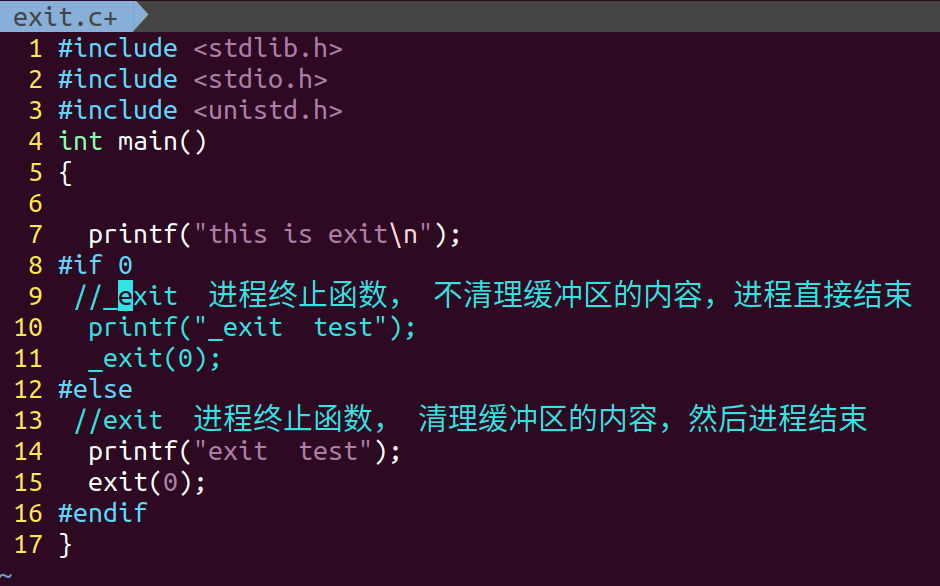

# 文件IO
## 系统IO

### 文件打开 open
```c
       #include <sys/types.h>
       #include <sys/stat.h>
       #include <fcntl.h>

       int open(const char *pathname, int flags);
       int open(const char *pathname, int flags, mode_t mode);
```
* pathname: 文件名
* flags： 打开方式   
* mode: 权限
* 返回值： 成功： 文件描述符
          失败： -1

eg:


### 关闭文件 close
```c
    #include <unistd.h>

    int close(int fd);
```
*  fd: 文件描述符

eg:


###  读取文件 read
```c
    #include <unistd.h>
    ssize_t read(int fd, void *buf, size_t count);
```
*   fd:  文件描述符
* *buf:  从文件中读取的内容
* count: 读取字节的大小

* 返回值： 
        1.  成功：  正确读取字节的个数   
        2.   0 :    文件末尾
      	3.  失败： -1


eg：


### 写文件  write
```c
       #include <unistd.h>
       ssize_t write(int fd, const void *buf, size_t count);
```
*   fd:  文件描述符
* *buf:  将数据写入文件
* count: 写入数据字节的大小
* 返回值： 成功：真实写入文件的数据的大小
          失败:-1 

eg:


### 文件指针偏移  lseek
```c
    #include <sys/types.h>
    #include <unistd.h>

    off_t lseek(int fd, off_t offset, int whence);
```
* fd:文件描述符
* offset： 偏移量   -  往上偏移   + 往下偏移
* whence： 参照点  
1. SEEK_SET  文件开头
2. SEEK_CUR  文件当前位置
3. SEEK_END  文件末尾

eg：


###  文件权限的判断  access
```c

    #include <unistd.h>
    int access(const char *pathname, int mode);
```
* pathname: 文件名
* mode : 文件权限
> 1. R_OK   是否可读
> 2. W_OK   是否可写
> 3. X_OK   是否可执行
> 4. F_OK   是否存在

eg：


## C 库IO 

### 打开文件  fopen
```c
 	#include <stdio.h>
    FILE *fopen(const char *pathname, const char *mode);
```
* pathname: 文件名
* mode ： 打开方式
* 返回值： 文件指针

eg:
```c
FILE* fp  = fopen("f1","r");
```

### 关闭文件 fclose
```c
 	#include <stdio.h>
    int fclose(FILE *stream);
```
* stream: 文件指针

eg：
```c
FILE* fp  = fopen("f1","r");
fclose(fp);
```

### 按字符读取/字符串
```c
	   #include <stdio.h>
       int fgetc(FILE *stream);
       char *fgets(char *s, int size, FILE *stream);
       int fputc(int c, FILE *stream);
       int fputs(const char *s, FILE *stream);
```
* stream: 文件指针
* c:字符
* s：字符串
eg：


### 文件指针偏移/文件位置
```c
       #include <stdio.h>
       int fseek(FILE *stream, long offset, int whence);
       long ftell(FILE *stream);
```
* stream: 文件指针
* offset： 偏移量   -  往上偏移   + 往下偏移
* whence： 参照点  
1. SEEK_SET  文件开头
2. SEEK_CUR  文件当前位置
3. SEEK_END  文件末尾

eg:


# 进程

### 派生进程  fork
```c
 	 #include <sys/types.h>
	 #include <unistd.h>
	
	 pid_t fork(void);
```
* 返回值： 进程pid

eg:


### 获取进程号：
```c
uid_t getuid(void)：获得进程的用户标识号。
gid_t getgid(void)：获得进程的用户所属的用户组ID。 
pid_t getpid(void)：要获得当前进程的ID。
pid_t getppid(void)：获得当前进程的父进程的ID。
pid_t getpgrp(void)：获得当前进程所在的进程组的ID。
pid_t getpgid(pid_t pid)：获得进程ID为pid的进程所在的进程组ID。
```
eg:
```c
#include <sys/types.h>
#include <unistd.h>
#include <stdio.h>

int main()
{
  int pid  = getpid();
  printf("pid = %d\n",getpid());//获取当前进程id
  printf("ppid = %d\n",getppid());//获取父进程id
  printf("uid = %d\n",getuid());//获取父进程id
  printf("gid = %d\n",getgid());//获取父进程id
  printf("grp = %d\n",getpgrp());//获取父进程id
  printf("pgid = %d\n",getpgid(pid));//获取父进程id
  while(1);
}
```

### 执行其他进程
```c
  #include <stdlib.h>
  int system(const char *command);

   #include <unistd.h>
	   int execl(const char *path, const char *arg, ...
                       /* (char  *) NULL */);
       int execlp(const char *file, const char *arg, ...
                       /* (char  *) NULL */);
       int execle(const char *path, const char *arg, ...
                       /*, (char *) NULL, char * const envp[] */);
       int execv(const char *path, char *const argv[]);
       int execvp(const char *file, char *const argv[]);
       int execvpe(const char *file, char *const argv[],
                       char *const envp[]);
```
* path : 路径名 
* file： 程序名
* arg：参数  "ls","-l","-a",NULL

eg:


```c
#include <stdio.h>
#include <stdlib.h>
#include <unistd.h>
int main()
{

  //system("ls -l");

  //execl("/bin/ls","ls","-l","-a",NULL);
  //execl("./","hello",NULL);    //path
  //execlp("./hello","hello",NULL);  //path+file  
  //execlp("/bin/ls","ls","-l",NULL);

     /*
     char *argv[2];
     argv[0] = "hello";
     argv[1] = NULL;
     execv("./",argv);
     */

  char *argv[3];
  argv[0]= "ls";
  argv[1]= "-l";
  argv[2]= NULL;
  execvp("/bin/ls",argv);

  printf("hello world\n");
}

```

### 进程退出  exit()  _exit()
```c
       #include <stdlib.h>
          void exit(int status);
       #include <unistd.h>
       void _exit(int status);
```
* status: 进程退出的返回值
eg:



### 进程等待  wait()  /  waitpid()

```c
	   #include <sys/types.h>
       #include <sys/wait.h>

       pid_t wait(int *wstatus);

       pid_t waitpid(pid_t pid, int *wstatus, int options);
```
* wstatus :  获取exit(status),中status的值
* pid： 等待指定的进程退出   >0  指定的pid
   > =0  系统里的任意子进程
   > =-1 进程组里的任意的子进程
   > <-1 pid的绝对值的进程
* options：  0 阻塞状态
         WNOHANG：非阻塞状态
WIFEXITED(status):如果进程通过系统调用_exit或函数调用exit正常退出，该宏的值为真
WEXITSTATUS(status):如果WIFEXITED(status)返回真，该宏返回由子进程调用_exit(status)或exit(status)时设置的调用参数status值。

eg:


# 线程    gcc   xxx.c   -lpthread

### 线程创建  pthread_create()
```c
#include <pthread.h>

pthread_t    thread;	//线程id变量
int pthread_create(pthread_t *thread, const pthread_attr_t *attr,
                          void *(*start_routine) (void *), void *arg);
```

* thread:  线程id
* const pthread_attr_t *attr:线程属性，一般设置为NULL
* void *(*start_routine) (void *): 函数指针
* void *arg： 函数的参数，如果不穿参数则设置为NULL


### 线程退出  pthread_exit()
```c
       #include <pthread.h>
       void pthread_exit(void *retval);
```
*  retval ：线程退出的值


### 等待线程退出  pthread_join()
```c
       #include <pthread.h>
       int pthread_join(pthread_t thread, void **retval);
```
* retval: 获取pthread_exit(*retval)中的retval的值

eg:


### 线程取消 pthread_cancel()
### 获取线程id pthread_self()

### 互斥锁(线程锁) 
```c

      pthread_mutex_t    mutex          定义线程锁变量 
      pthread_mutex_init(&mutex,NULL);  初始化线程锁
      pthread_mutex_lock(&mutex);       上锁
      pthread_mutex_unlock(&mutex);     解锁
```
* NULL：线程属性
* mutex: 线程锁变量

eg:
```c
#include <sys/types.h>
#include <sys/stat.h>
#include <fcntl.h>
#include <unistd.h>
#include <pthread.h>

//互斥锁  线程锁
/*
   1. pthread_mutex_t    flag          定义线程锁变量 
   2. pthread_mutex_init(&flag,NULL);  初始化线程锁
   3. pthread_mutex_lock(&flag);       上锁
       需要上锁的资源
   4. pthread_mutex_unlock(&flag);     解锁
*/


pthread_mutex_t    flag;        //  定义线程锁变量 


void *read_file()
{

  pthread_mutex_lock(&flag);    //   上锁

  int fd = open("./f1",O_RDONLY);
  if(fd < 0)
  {
    perror("open");
    return NULL;
  }

  int ret,i;
  while(1)
  {
    ret = read(fd,&i,4);
    if(ret < 0)
    {
      perror("read");
      return NULL;
    }else if(0 ==ret )
    {
      break;
    }else
    printf("pthread ret: %d\ti: %d\n",ret,i);

    sleep(1);
  }

  close(fd);

  pthread_mutex_unlock(&flag);  //   解锁
}

int main()
{

  pthread_mutex_init(&flag,NULL);  //初始化线程锁

  pthread_t pth1,pth2;

  pthread_create(&pth1,NULL,(void *)read_file,NULL);


  pthread_mutex_lock(&flag);      // 上锁

  int fd = open("./f1",O_RDONLY);
  if(fd < 0)
  {
    perror("open");
    return -1;
  }

  int ret,i;
  while(1)
  {
    ret = read(fd,&i,4);
    if(ret < 0)
    {
      perror("read");
      return NULL;
    }else if(0 ==ret )
    {
      break;
    }else
    printf("main ret: %d\ti : %d\n",ret,i);
    sleep(1);
  }
  close(fd);
  pthread_mutex_unlock(&flag);  //   解锁
  pthread_join(pth1,NULL);
}

```


# 1.仿照的我的笔记你们自己再完善，将所学的函数的笔记都写出来

# 2.把链表写入（write）文件  链表长度自己控制，节点内容如下：

```
struct student
{
    char name[32];
    int age;
    char sex;
    struct student *next;
};
```

# 3.将上面的链表从文件中读取出来（read）

show(head)

# 4. 有以文件内容如下，将里面的“192.168.1.1”,"8888"从文件中提取出来（fgetc/fgets）
* work.txt
```
ip:192.168.1.1
port:8888
```


# fork，system，sprintf
编译一个程序，实现创建两个进程，父进程：每隔1秒钟时间创建一个文件 1，2，3，4，5，6，7，8，9，10       子进程：每隔2秒删除一个文件1，2，3。。。。。


